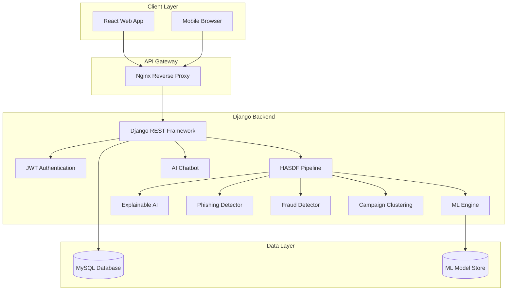
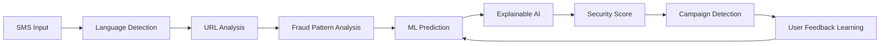
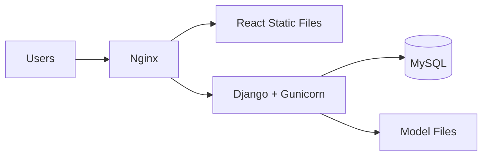

# System Architecture — TextGuard Platform

## High-Level Architecture

## HASDF Framework Architecture

## Component Description

| Component | Technology | Responsibility |
|-----------|-----------|----------------|
| React Frontend | React 18, Bootstrap 5 | User interface, charts, forms |
| Django REST API | Django 4.2, DRF | Business logic, API endpoints |
| HASDF Pipeline | Python | Orchestrates all analysis modules |
| ML Engine | Scikit-Learn | Spam/ham classification |
| XAI Module | SHAP/LIME hybrid | Word-level explanations |
| Phishing Module | tldextract, regex | URL risk analysis |
| Fraud Module | Pattern matching | Banking/lottery/job/investment fraud |
| Campaign Module | Clustering | Spam campaign detection |
| Chatbot | Rule-based NLP | Security guidance |

## Deployment Architecture

