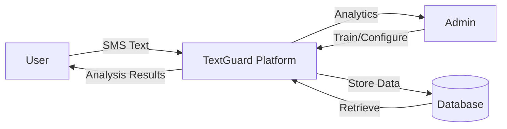
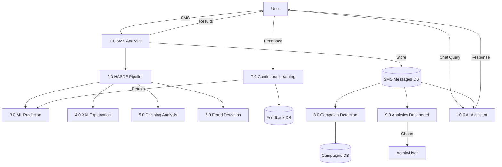
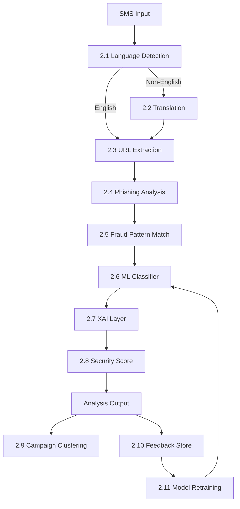

# Data Flow Diagrams

## DFD Level 0 (Context Diagram)

## DFD Level 1

## DFD Level 2 — HASDF Pipeline Detail

## Data Stores

| Store | Contents |
|-------|----------|
| D1 — SMS Messages | Message text, predictions, XAI data, timestamps |
| D2 — Feedback | User corrections for continuous learning |
| D3 — Campaigns | Clustered spam campaign data |
| D4 — Model Metrics | Training history and comparison results |
