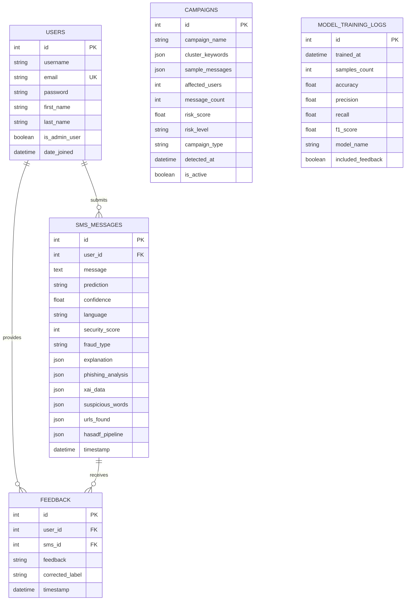

# Entity-Relationship Diagram

## ER Diagram

## Relationships

| Relationship | Type | Description |
|-------------|------|-------------|
| User → SMS Messages | One-to-Many | User can analyze multiple SMS |
| User → Feedback | One-to-Many | User provides feedback on predictions |
| SMS → Feedback | One-to-Many | SMS can receive feedback from users |
| Campaigns | Independent | Derived from clustered SMS messages |
