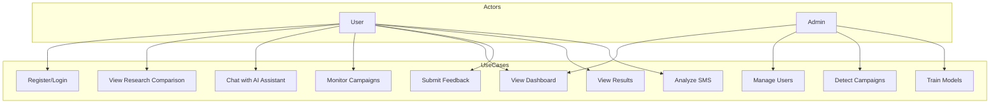
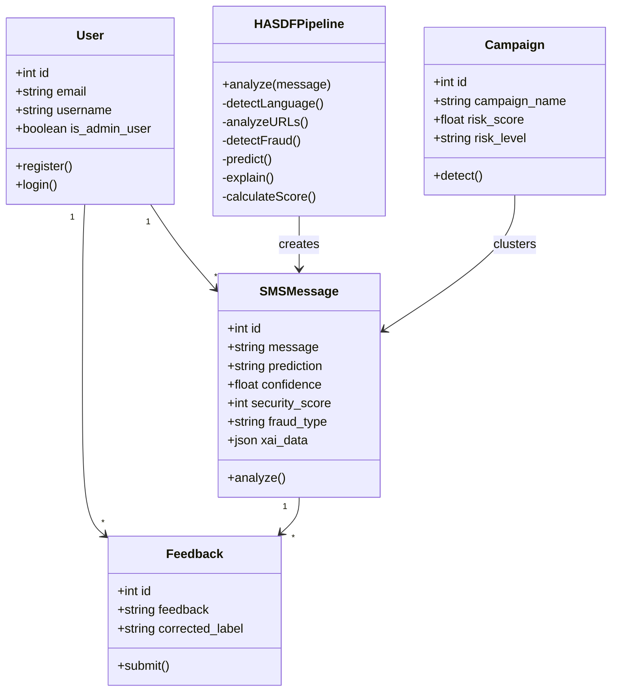
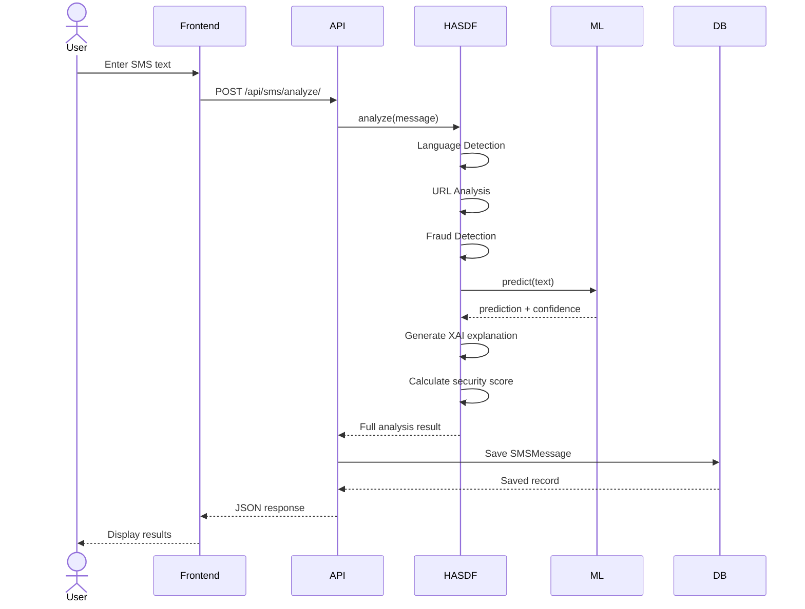
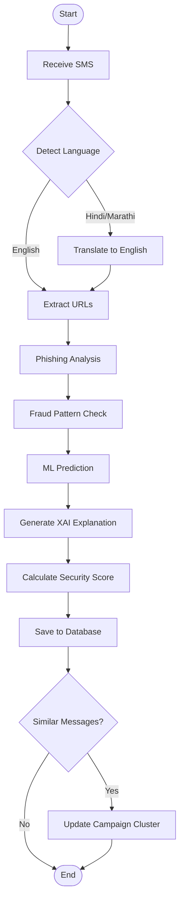

# UML Diagrams

## Use Case Diagram

```mermaid
graph TB
    subgraph Actors
        U[User]
        A[Admin]
    end

    subgraph UseCases
        UC1[Analyze SMS]
        UC2[View Results]
        UC3[Submit Feedback]
        UC4[View Dashboard]
        UC5[Monitor Campaigns]
        UC6[Chat with AI Assistant]
        UC7[View Research Comparison]
        UC8[Train Models]
        UC9[Detect Campaigns]
        UC10[Manage Users]
        UC11[Register/Login]
    end

    U --> UC1
    U --> UC2
    U --> UC3
    U --> UC4
    U --> UC5
    U --> UC6
    U --> UC7
    U --> UC11
    A --> UC8
    A --> UC9
    A --> UC10
    A --> UC4
```

## Class Diagram — Core Models

```mermaid
classDiagram
    class User {
        +int id
        +string email
        +string username
        +boolean is_admin_user
        +register()
        +login()
    }

    class SMSMessage {
        +int id
        +string message
        +string prediction
        +float confidence
        +int security_score
        +string fraud_type
        +json xai_data
        +analyze()
    }

    class Feedback {
        +int id
        +string feedback
        +string corrected_label
        +submit()
    }

    class Campaign {
        +int id
        +string campaign_name
        +float risk_score
        +string risk_level
        +detect()
    }

    class HASDFPipeline {
        +analyze(message)
        -detectLanguage()
        -analyzeURLs()
        -detectFraud()
        -predict()
        -explain()
        -calculateScore()
    }

    User "1" --> "*" SMSMessage
    User "1" --> "*" Feedback
    SMSMessage "1" --> "*" Feedback
    HASDFPipeline --> SMSMessage : creates
    Campaign --> SMSMessage : clusters
```

## Sequence Diagram — SMS Analysis

```mermaid
sequenceDiagram
    actor User
    participant Frontend
    participant API
    participant HASDF
    participant ML
    participant DB

    User->>Frontend: Enter SMS text
    Frontend->>API: POST /api/sms/analyze/
    API->>HASDF: analyze(message)
    HASDF->>HASDF: Language Detection
    HASDF->>HASDF: URL Analysis
    HASDF->>HASDF: Fraud Detection
    HASDF->>ML: predict(text)
    ML-->>HASDF: prediction + confidence
    HASDF->>HASDF: Generate XAI explanation
    HASDF->>HASDF: Calculate security score
    HASDF-->>API: Full analysis result
    API->>DB: Save SMSMessage
    DB-->>API: Saved record
    API-->>Frontend: JSON response
    Frontend-->>User: Display results
```

## Activity Diagram — HASDF Workflow

```mermaid
flowchart TD
    Start([Start]) --> Receive[Receive SMS]
    Receive --> Lang{Detect Language}
    Lang -->|Hindi/Marathi| Translate[Translate to English]
    Lang -->|English| URL[Extract URLs]
    Translate --> URL
    URL --> Phish[Phishing Analysis]
    Phish --> Fraud[Fraud Pattern Check]
    Fraud --> ML[ML Prediction]
    ML --> XAI[Generate XAI Explanation]
    XAI --> Score[Calculate Security Score]
    Score --> Save[Save to Database]
    Save --> Campaign{Similar Messages?}
    Campaign -->|Yes| Cluster[Update Campaign Cluster]
    Campaign -->|No| End([End])
    Cluster --> End
```
